# Design Document: SmartShelf India

## Overview

SmartShelf India is a serverless, cloud-native IoT ecosystem built entirely on AWS services to address the unique challenges of Indian retail. The system architecture follows a three-tier model: IoT Device Layer (ESP32 microcontrollers with e-ink/TFT displays), Cloud Services Layer (AWS IoT Core, ECS Fargate, Lambda, DocumentDB), and Application Layer (Admin Dashboard, Mobile APIs).

The design prioritizes offline resilience for unreliable Indian internet connectivity, cost optimization through serverless architectures, and horizontal scalability to support multi-store deployments. Security is enforced through X.509 certificate-based device authentication and end-to-end encryption for all data transmission.

Key architectural decisions include:

- MQTT over AWS IoT Core for low-bandwidth, reliable device communication
- DocumentDB for flexible schema to accommodate diverse product catalogs
- ECS Fargate for containerized microservices that require persistent connections (competitor scraping, vision processing)
- Lambda for event-driven operations (price updates, alerts, data transformations)
- Step Functions for orchestrating complex workflows (bulk updates, expiry management)
- S3 + CloudFront for static asset delivery and dashboard hosting

## Architecture

### High-Level Architecture Diagram

**Note:** The aws-diagrams tool has Windows compatibility limitations. The Mermaid diagrams below provide comprehensive views of the system architecture.

#### System Architecture Overview

```mermaid
graph TB
    subgraph Edge["🏪 Edge Layer - Physical Store"]
        ESP32[ESP32 Microcontrollers<br/>E-Ink/TFT Displays<br/>NFC Tags, LED Indicators]
        Sensors[IR/Camera Sensors<br/>Shelf Monitoring]
        Gateway[Local Gateway<br/>Wi-Fi/BLE Bridge]
    end

    subgraph IoT["☁️ IoT Layer - AWS IoT Core"]
        IoTCore[AWS IoT Core<br/>MQTT Broker<br/>X.509 Certificate Auth]
        Shadow[Device Shadow<br/>Desired/Reported State<br/>Offline Sync]
        Rules[IoT Rules Engine<br/>Message Routing<br/>Data Transformation]
    end

    subgraph Compute["⚡ Compute Layer - Serverless"]
        API[API Gateway<br/>REST Endpoints<br/>Rate Limiting]
        Lambda1[Lambda Functions<br/>• Price Updates<br/>• Alert Processing<br/>• Event Handlers]
        Fargate[ECS Fargate<br/>• Competitor Scraper<br/>• Vision Processing<br/>• ML Inference]
        StepFn[Step Functions<br/>• Bulk Updates<br/>• Expiry Workflows<br/>• Orchestration]
    end

    subgraph Data["💾 Database Layer"]
        DocDB[(DocumentDB<br/>MongoDB Compatible<br/>• Products<br/>• Devices<br/>• Alerts<br/>• Analytics)]
        S3[(S3 Buckets<br/>• Images<br/>• Planograms<br/>• Reports<br/>• Static Assets)]
    end

    subgraph AI["🤖 AI/ML Layer"]
        SageMaker[Amazon SageMaker<br/>• Shelf Vision Model<br/>• Price Optimization<br/>• Demand Forecasting]
        Pinpoint[Amazon Pinpoint<br/>• SMS Notifications<br/>• Email Alerts<br/>• Push Messages]
    end

    subgraph App["📱 Application Layer"]
        CloudFront[CloudFront CDN<br/>Global Distribution<br/>HTTPS/SSL]
        Cognito[Cognito User Pools<br/>JWT Authentication<br/>Role-Based Access]
        Dashboard[React Admin Dashboard<br/>Store Management<br/>Analytics]
    end

    subgraph Users["👥 End Users"]
        Owner[Store Owner/Manager<br/>Full Access]
        Staff[Store Staff<br/>Limited Access]
        Delivery[Delivery Partners<br/>Order Picking]
        Customer[Customers<br/>NFC Product Info]
    end

    %% Edge to Cloud
    ESP32 -->|MQTT over TLS| Gateway
    Sensors -->|Local Network| Gateway
    Gateway -->|Internet| IoTCore

    %% IoT Layer Flow
    IoTCore <-->|Sync State| Shadow
    IoTCore -->|Route Messages| Rules
    Rules -->|Trigger| Lambda1
    Rules -->|Store Data| DocDB

    %% Compute Layer Flow
    Lambda1 -->|Read/Write| DocDB
    Lambda1 -->|Publish Updates| IoTCore
    Lambda1 -->|Send Alerts| Pinpoint
    Lambda1 -->|Start Workflow| StepFn
    Fargate -->|Query/Update| DocDB
    Fargate -->|Store/Retrieve| S3
    Fargate -->|Inference| SageMaker
    StepFn -->|Invoke| Lambda1
    StepFn -->|Trigger| Fargate

    %% API Flow
    API -->|Authenticate| Cognito
    API -->|Invoke| Lambda1
    API -->|Direct Query| DocDB

    %% Frontend Flow
    Dashboard -->|HTTPS| CloudFront
    Dashboard -->|API Calls| API
    CloudFront -->|Serve Assets| S3

    %% User Interactions
    Owner -->|Manage| Dashboard
    Staff -->|Monitor| Dashboard
    Delivery -->|Mobile App| API
    Customer -->|NFC Tap| CloudFront

    %% AI/ML Flow
    S3 -->|Training Data| SageMaker
    SageMaker -->|Model Results| DocDB
    Pinpoint -->|Notifications| Owner
    Pinpoint -->|Alerts| Staff

    style Edge fill:#e1f5ff
    style IoT fill:#fff4e1
    style Compute fill:#ffe1f5
    style Data fill:#e1ffe1
    style AI fill:#f5e1ff
    style App fill:#ffe1e1
    style Users fill:#f0f0f0
```



#### Detailed Data Flow Diagram


### Component Architecture

The system is decomposed into the following microservices and components:

1. **Device Management Service** (Lambda + IoT Core)
    - Device provisioning and certificate management
    - Device shadow synchronization
    - Health monitoring and battery alerts

2. **Dynamic Pricing Service** (Lambda + Step Functions)
    - Price update orchestration
    - Bulk pricing operations
    - Price history tracking

3. **Expiry Management Service** (Lambda + Step Functions + SageMaker)
    - Expiry date monitoring (scheduled Lambda)
    - Discount calculation using ML models
    - Automated flash sale triggers

4. **Competitor Intelligence Service** (ECS Fargate)
    - Web scraping from Blinkit, Zepto, BigBasket
    - Price comparison analytics
    - Alert generation for price gaps

5. **Shelf Vision Service** (ECS Fargate + SageMaker)
    - Image processing from shelf cameras
    - Empty shelf detection using trained models
    - Stock alert generation

6. **Order Picking Service** (Lambda)
    - Flash-to-Find LED control
    - Order fulfillment tracking
    - Delivery partner coordination

7. **Planogram Compliance Service** (Lambda)
    - Planogram parsing and storage
    - Location-based compliance checking
    - Violation reporting

8. **Admin Dashboard** (React SPA on S3 + CloudFront)
    - Store management interface
    - Analytics and reporting
    - Configuration management

9. **Mobile API** (API Gateway + Lambda)
    - Staff mobile app backend
    - Delivery partner app backend
    - Customer product information API

## Components and Interfaces

### ESP32 Device Firmware

**Responsibilities:**

- Maintain MQTT connection to AWS IoT Core
- Update e-ink/TFT display when price changes received
- Control LED for Flash-to-Find feature
- Expose NFC tag with product identifier
- Report battery level and device health
- Handle offline mode with local state persistence

**Interfaces:**

- MQTT Topics (Subscribe):
    - `smartshelf/{deviceId}/price/update` - Receive price updates
    - `smartshelf/{deviceId}/flash/command` - Receive LED flash commands
    - `smartshelf/{deviceId}/config/update` - Receive configuration changes
- MQTT Topics (Publish):
    - `smartshelf/{deviceId}/status` - Publish device health status
    - `smartshelf/{deviceId}/ack` - Acknowledge received commands
- NFC: NDEF format with product URL

**Data Structures:**

```javascript
// Price Update Message
{
  "deviceId": "string",
  "productId": "string",
  "price": number,
  "currency": "INR",
  "displayText": {
    "en": "string",
    "hi": "string"
  },
  "isFlashSale": boolean,
  "timestamp": "ISO8601"
}

// Device Status Message
{
  "deviceId": "string",
  "batteryLevel": number,  // 0-100
  "signalStrength": number,  // RSSI
  "displayType": "eink" | "tft",
  "firmwareVersion": "string",
  "lastUpdate": "ISO8601"
}
```

### AWS IoT Core Configuration

**Device Shadows:**
Each ESL device has a shadow document maintaining:

```json
{
    "state": {
        "reported": {
            "batteryLevel": 85,
            "online": true,
            "lastPrice": 299.0,
            "productId": "PROD-12345",
            "location": "Aisle-3-Shelf-2",
            "language": "hi"
        },
        "desired": {
            "price": 299.0,
            "flashEnabled": false,
            "syncInterval": 300
        }
    }
}
```

**IoT Rules:**

1. **Price Update Rule**: Routes price updates to Lambda for validation and DocumentDB logging
2. **Device Status Rule**: Routes status messages to Lambda for health monitoring
3. **Alert Rule**: Routes critical events (low battery, offline) to Pinpoint for notifications

### Dynamic Pricing Service

**API Endpoints:**

- `POST /api/pricing/update` - Update single product price
- `POST /api/pricing/bulk-update` - Bulk price update (triggers Step Function)
- `GET /api/pricing/history/{productId}` - Get price history
- `POST /api/pricing/rules` - Configure automated pricing rules

**Lambda Functions:**

1. **PriceUpdateHandler**: Validates price, publishes to IoT Core, logs to DocumentDB
2. **BulkPriceOrchestrator**: Initiates Step Function for parallel processing
3. **PriceHistoryQuery**: Retrieves historical pricing data

**Step Function Workflow (Bulk Update):**

```
Start → Validate Input → Map (Parallel Processing) →
  For Each Product:
    - Update DocumentDB
    - Publish to IoT Core
    - Wait for ACK (with timeout)
  → Aggregate Results → Generate Report → End
```

### Expiry Management Service

**Scheduled Lambda:**

- Runs every 6 hours
- Queries DocumentDB for products with expiry dates within 2 days
- Calculates discount percentage based on:
    - Days until expiry
    - Current inventory level
    - Historical sales velocity
    - Competitor pricing

**Discount Calculation Algorithm:**

```python
def calculate_discount(days_until_expiry, inventory_count, avg_daily_sales):
    urgency_factor = 1 - (days_until_expiry / 2)  # 0 to 1
    inventory_factor = min(inventory_count / (avg_daily_sales * 2), 1)
    base_discount = 0.20  # 20% minimum
    max_discount = 0.60  # 60% maximum

    discount = base_discount + (max_discount - base_discount) * urgency_factor * inventory_factor
    return round(discount, 2)
```

**SageMaker Integration:**

- Trained model predicts optimal discount for maximum revenue recovery
- Model inputs: product category, historical sales, competitor prices, time of day
- Model output: recommended discount percentage

### Competitor Intelligence Service

**ECS Fargate Task:**

- Runs as scheduled task (every 4 hours)
- Uses headless browser (Puppeteer) for JavaScript-heavy sites
- Implements rate limiting and user-agent rotation
- Stores results in DocumentDB with source attribution

**Scraping Targets:**

- Blinkit API (if available) or web scraping
- Zepto product pages
- BigBasket API
- JioMart listings

**Data Structure:**

```javascript
{
  "productId": "PROD-12345",
  "productName": "Amul Milk 1L",
  "competitorPrices": [
    {
      "source": "Blinkit",
      "price": 62.00,
      "inStock": true,
      "scrapedAt": "ISO8601",
      "url": "string"
    }
  ],
  "ourPrice": 65.00,
  "priceDifference": 3.00,
  "percentageDiff": 4.6
}
```

### Shelf Vision Service

**ECS Fargate Task:**

- Processes images from shelf cameras uploaded to S3
- Invokes SageMaker endpoint for inference
- Detects empty shelves using object detection model
- Matches detected empty spaces to planogram data

**SageMaker Model:**

- Architecture: YOLOv8 or EfficientDet for object detection
- Training data: Labeled images of full vs empty shelves
- Output: Bounding boxes for empty shelf regions with confidence scores

**Processing Pipeline:**

1. Camera uploads image to S3 (triggered every 15 minutes)
2. S3 event triggers Lambda
3. Lambda invokes ECS task with image S3 path
4. ECS task downloads image, calls SageMaker endpoint
5. If empty shelf detected (confidence > 0.8):
    - Query DocumentDB for product at that location
    - Publish alert to Pinpoint for Store_Staff
    - Log event in DocumentDB

### Order Picking Service (Flash-to-Find)

**API Endpoint:**

- `POST /api/orders/flash-to-find` - Initiate Flash-to-Find for order

**Lambda Function Flow:**

1. Receive order ID from delivery partner app
2. Query DocumentDB for order items and their ESL device IDs
3. For each device, publish flash command to MQTT topic
4. Track acknowledgments from devices
5. Return list of flashing devices to app

**Flash Command:**

```javascript
{
  "deviceId": "string",
  "flashPattern": "pulse",  // pulse, blink, solid
  "duration": 30,  // seconds
  "color": "blue"  // if RGB LED available
}
```

### Planogram Compliance Service

**Planogram Upload:**

- Store Owner uploads PDF/Excel planogram
- Lambda parses document using Textract or custom parser
- Extracts: Product ID, Aisle, Shelf, Position, Facing Count
- Stores in DocumentDB

**Compliance Checking:**

- Triggered when device location changes (from Device Shadow)
- Compares actual location vs planogram requirement
- Generates violation if mismatch detected

**Data Structure:**

```javascript
{
  "planogramId": "string",
  "storeId": "string",
  "products": [
    {
      "productId": "PROD-12345",
      "location": {
        "aisle": "3",
        "shelf": "2",
        "position": "left"
      },
      "facingCount": 4,
      "priority": "high"  // for brand agreements
    }
  ]
}
```

### Admin Dashboard

**Technology Stack:**

- React 18 with TypeScript
- Material-UI for components
- Recharts for analytics visualization
- React Query for API state management
- Hosted on S3 as static site, served via CloudFront

**Key Features:**

1. **Device Management View**: Grid of all ESL devices with status indicators
2. **Pricing Dashboard**: Bulk price update interface, price history charts
3. **Expiry Management**: List of near-expiry products with auto-sale status
4. **Competitor Intelligence**: Price comparison tables with visual indicators
5. **Stock Alerts**: Real-time feed of empty shelf alerts
6. **Analytics**: Revenue impact, waste reduction metrics, device health stats
7. **Planogram Viewer**: Visual representation of shelf layout with compliance status

**Authentication:**

- Cognito User Pools for authentication
- JWT tokens for API authorization
- Role-based access control (Owner, Manager, Staff)

### Mobile API

**API Gateway Configuration:**

- REST API with Cognito authorizer
- Rate limiting: 1000 requests per minute per user
- CORS enabled for mobile apps

**Endpoints:**

- `GET /api/devices` - List all devices
- `GET /api/devices/{id}` - Get device details
- `POST /api/alerts/acknowledge` - Acknowledge stock alert
- `POST /api/orders/flash` - Trigger Flash-to-Find
- `GET /api/products/{id}` - Get product details (for NFC tap)
- `GET /api/analytics/summary` - Get dashboard summary

## Data Models

### DocumentDB Collections

**devices**

```javascript
{
  "_id": "ObjectId",
  "deviceId": "ESP32-001",
  "storeId": "STORE-MUM-01",
  "productId": "PROD-12345",
  "location": {
    "aisle": "3",
    "shelf": "2",
    "position": "left"
  },
  "displayType": "eink",
  "firmwareVersion": "1.2.3",
  "batteryLevel": 85,
  "online": true,
  "lastSeen": "ISO8601",
  "provisionedAt": "ISO8601",
  "certificateArn": "string"
}
```

**products**

```javascript
{
  "_id": "ObjectId",
  "productId": "PROD-12345",
  "storeId": "STORE-MUM-01",
  "name": {
    "en": "Amul Milk 1L",
    "hi": "अमूल दूध 1L"
  },
  "category": "Dairy",
  "price": 65.00,
  "currency": "INR",
  "expiryDate": "ISO8601",
  "batchNumber": "string",
  "barcode": "string",
  "inventory": {
    "count": 24,
    "reorderLevel": 10
  },
  "isFlashSale": false,
  "flashSalePrice": null,
  "createdAt": "ISO8601",
  "updatedAt": "ISO8601"
}
```

**price_history**

```javascript
{
  "_id": "ObjectId",
  "productId": "PROD-12345",
  "price": 65.00,
  "previousPrice": 68.00,
  "changeReason": "competitor_match",
  "changedBy": "user-id",
  "timestamp": "ISO8601"
}
```

**alerts**

```javascript
{
  "_id": "ObjectId",
  "alertType": "empty_shelf" | "low_battery" | "device_offline" | "compliance_violation",
  "severity": "low" | "medium" | "high",
  "deviceId": "ESP32-001",
  "productId": "PROD-12345",
  "message": "string",
  "status": "open" | "acknowledged" | "resolved",
  "createdAt": "ISO8601",
  "acknowledgedAt": "ISO8601",
  "acknowledgedBy": "user-id",
  "resolvedAt": "ISO8601"
}
```

**competitor_prices**

```javascript
{
  "_id": "ObjectId",
  "productId": "PROD-12345",
  "source": "Blinkit",
  "price": 62.00,
  "inStock": true,
  "url": "string",
  "scrapedAt": "ISO8601"
}
```

**planograms**

```javascript
{
  "_id": "ObjectId",
  "planogramId": "PLANO-001",
  "storeId": "STORE-MUM-01",
  "name": "Dairy Section Q1 2024",
  "products": [
    {
      "productId": "PROD-12345",
      "location": {
        "aisle": "3",
        "shelf": "2",
        "position": "left"
      },
      "facingCount": 4
    }
  ],
  "uploadedAt": "ISO8601",
  "uploadedBy": "user-id"
}
```

**orders**

```javascript
{
  "_id": "ObjectId",
  "orderId": "ORD-12345",
  "storeId": "STORE-MUM-01",
  "items": [
    {
      "productId": "PROD-12345",
      "quantity": 2,
      "deviceId": "ESP32-001"
    }
  ],
  "deliveryPartnerId": "user-id",
  "status": "picking" | "ready" | "delivered",
  "flashStartedAt": "ISO8601",
  "pickedAt": "ISO8601",
  "deliveredAt": "ISO8601"
}
```

### Data Flow Scenarios

**Scenario 1: Price Update Flow**

1. Store Owner updates price in Admin Dashboard
2. Dashboard sends POST to API Gateway `/api/pricing/update`
3. API Gateway invokes PriceUpdateHandler Lambda
4. Lambda validates price and updates DocumentDB `products` collection
5. Lambda inserts record into `price_history` collection
6. Lambda publishes message to IoT Core topic `smartshelf/{deviceId}/price/update`
7. ESP32 device receives message, updates display
8. ESP32 publishes ACK to `smartshelf/{deviceId}/ack`
9. IoT Rules Engine routes ACK to Lambda for confirmation logging

**Scenario 2: Empty Shelf Detection Flow**

1. Shelf camera uploads image to S3 bucket every 15 minutes
2. S3 event triggers ShelfVisionTrigger Lambda
3. Lambda invokes ECS Fargate task with image S3 path
4. ECS task downloads image, calls SageMaker endpoint
5. SageMaker returns empty shelf detection (confidence 0.92)
6. ECS task queries DocumentDB for product at detected location
7. ECS task creates alert in `alerts` collection
8. ECS task publishes notification via Pinpoint to Store_Staff
9. Store_Staff receives SMS/push notification
10. Staff acknowledges alert via mobile app
11. Mobile app calls API to update alert status to "acknowledged"

**Scenario 3: Automated Expiry Flash Sale Flow**

1. Scheduled Lambda (ExpiryMonitor) runs every 6 hours
2. Lambda queries DocumentDB for products with expiry within 2 days
3. For each near-expiry product:
    - Lambda calls SageMaker endpoint for discount recommendation
    - Lambda calculates final discount price
    - Lambda updates product in DocumentDB with `isFlashSale: true`
    - Lambda publishes price update to all associated ESL devices
4. ESP32 devices update displays with sale price and "Flash Sale" indicator
5. Lambda logs flash sale event for analytics

**Scenario 4: Flash-to-Find Order Picking Flow**

1. Delivery Partner scans order barcode in mobile app
2. App sends POST to `/api/orders/flash-to-find` with order ID
3. Lambda queries DocumentDB `orders` collection for order items
4. Lambda retrieves device IDs for each product from `devices` collection
5. Lambda publishes flash commands to IoT Core for each device
6. ESP32 devices receive commands and activate LEDs
7. Delivery Partner picks items, confirms in app
8. App sends item confirmation to API
9. Lambda publishes stop-flash command to corresponding device
10. When all items picked, Lambda updates order status to "ready"

## Correctness Properties

A property is a characteristic or behavior that should hold true across all valid executions of a system—essentially, a formal statement about what the system should do. Properties serve as the bridge between human-readable specifications and machine-verifiable correctness guarantees.

### Property Reflection

After analyzing all 75 acceptance criteria, I identified several areas of redundancy:

1. **Device Authentication (1.1 and 9.1)**: Both test X.509 certificate validation - consolidated into single property
2. **Price Update Delivery (2.1 and 2.2)**: Combined into comprehensive property covering end-to-end update flow
3. **Alert Generation Patterns**: Multiple requirements test alert generation (1.5, 3.3, 4.3, 5.2, 8.3) - each remains separate as they test different alert types
4. **Data Completeness**: Requirements 1.2, 1.4, 4.2, 7.3 all test that responses contain required fields - consolidated into field presence properties per entity type
5. **Offline Behavior (10.1-10.5)**: These form a cohesive offline resilience property suite that should remain separate as each tests distinct aspects

The following properties represent the unique, non-redundant correctness guarantees for SmartShelf India:

### IoT Device Management Properties

**Property 1: Device Authentication with Valid Certificates**
_For any_ ESP32 device with a valid X.509 certificate signed by the system's certificate authority, connection attempts to IoT Core should succeed and establish an encrypted MQTT session.
**Validates: Requirements 1.1, 9.1, 9.2**

**Property 2: Device Authentication Rejection for Invalid Certificates**
_For any_ connection attempt with an invalid, expired, or revoked X.509 certificate, IoT Core should reject the connection and log the failed attempt with device identifier and timestamp.
**Validates: Requirements 9.3, 9.4**

**Property 3: Device Shadow State Completeness**
_For any_ device that successfully connects, the Device Shadow should contain all required fields: batteryLevel, online status, lastPrice, productId, location, and language.
**Validates: Requirements 1.2**

**Property 4: Device Status API Completeness**
_For any_ device status query, the API response should include all required fields: online/offline status, battery level, last update timestamp, assigned product, and location.
**Validates: Requirements 1.4**

**Property 5: Low Battery Alert Generation**
_For any_ device reporting battery level below 20%, the system should generate an alert and send it to Store Staff via Pinpoint.
**Validates: Requirements 1.5**

**Property 6: Unique Certificate Generation on Provisioning**
_For any_ two devices provisioned by the system, their X.509 certificates should have unique serial numbers and subject distinguished names.
**Validates: Requirements 9.5**

### Dynamic Pricing Properties

**Property 7: Price Update Delivery to All Devices**
_For any_ product with multiple associated ESL devices, when a price update is published, all devices should receive the update message via their respective MQTT topics.
**Validates: Requirements 2.1, 2.2**

**Property 8: Price Update Acknowledgment**
_For any_ price update successfully received by a device, the device should publish an acknowledgment message to its ACK topic.
**Validates: Requirements 2.2**

**Property 9: Price Update Retry with Exponential Backoff**
_For any_ price update that fails delivery, the system should retry exactly 3 times with exponentially increasing delays (e.g., 1s, 2s, 4s).
**Validates: Requirements 2.3**

**Property 10: Failed Update Logging and Alerting**
_For any_ price update where all 3 retry attempts fail, the system should log the failure to DocumentDB and generate an alert in the Admin Dashboard.
**Validates: Requirements 2.4**

**Property 11: Bulk Update Parallel Processing**
_For any_ bulk price update request with N products, the system should process all N updates in parallel (not sequentially).
**Validates: Requirements 2.5**

**Property 12: Price History Logging**
_For any_ price update, the system should create a price_history record containing the new price, previous price, change reason, changed by user, and timestamp.
**Validates: Requirements 2.1** (implicit requirement for audit trail)

### Expiry Management Properties

**Property 13: Discount Calculation for Near-Expiry Products**
_For any_ product with expiry date exactly 2 days away, the Expiry Management System should calculate a discount percentage between 20% and 60% based on inventory levels and sales velocity.
**Validates: Requirements 3.1**

**Property 14: Automated Flash Sale Activation**
_For any_ product that receives a calculated discount, the system should automatically update all associated ESL devices with the sale price and set the isFlashSale flag to true.
**Validates: Requirements 3.2**

**Property 15: Expired Product Marking and Alerts**
_For any_ product with expiry date in the past, the system should mark it as expired in DocumentDB and send removal alerts to Store Staff.
**Validates: Requirements 3.3**

**Property 16: Product Removal on Staff Confirmation**
_For any_ expired product where Store Staff confirms removal, the system should update inventory count to zero and remove the product from active listings.
**Validates: Requirements 3.4**

**Property 17: Custom Expiry Rule Precedence**
_For any_ product where the Store Owner has configured custom expiry rules, the system should apply those rules instead of default discount calculations.
**Validates: Requirements 3.5**

### Competitor Intelligence Properties

**Property 18: Competitor Price Fetching**
_For any_ product configured for competitor monitoring, when the scraper runs, it should fetch current prices from all specified competitor sources.
**Validates: Requirements 4.1**

**Property 19: Competitor Price Storage Completeness**
_For any_ fetched competitor price, the stored record in DocumentDB should include price, source, inStock status, timestamp, and URL.
**Validates: Requirements 4.2**

**Property 20: Price Gap Alert Generation**
_For any_ competitor price that is more than 10% lower than the store price, the system should generate a price alert in the Admin Dashboard.
**Validates: Requirements 4.3**

**Property 21: Scraping Failure Retry with Header Rotation**
_For any_ scraping attempt that receives a 403 or 429 response, the system should retry with different user-agent and request headers.
**Validates: Requirements 4.5**

### Shelf Vision and Stock Alert Properties

**Property 22: Empty Shelf Detection**
_For any_ shelf camera image where the trained model detects an empty shelf with confidence > 0.8, the system should identify the product location using planogram data.
**Validates: Requirements 5.1, 5.2**

**Property 23: Stock Alert Generation**
_For any_ detected empty shelf, the system should create an alert in DocumentDB and send a notification to Store Staff via Pinpoint.
**Validates: Requirements 5.2**

**Property 24: Alert Status Update on Acknowledgment**
_For any_ stock alert that Store Staff acknowledges, the alert status should change from "open" to "acknowledged" and record the acknowledgedAt timestamp.
**Validates: Requirements 5.3**

**Property 25: Automatic Alert Closure on Restock**
_For any_ previously empty shelf that the vision system detects as restocked, the corresponding alert should automatically change status to "resolved".
**Validates: Requirements 5.4**

**Property 26: Alert Prioritization by Demand**
_For any_ set of multiple simultaneous empty shelf alerts, they should be ordered by product demand score (calculated from sales velocity) in descending order.
**Validates: Requirements 5.5**

### Flash-to-Find Properties

**Property 27: Order Product Location Lookup**
_For any_ order ID scanned by a delivery partner, the system should return all product IDs in the order along with their corresponding ESL device IDs.
**Validates: Requirements 6.1**

**Property 28: Flash Command Broadcasting**
_For any_ set of device IDs identified for an order, the system should publish flash commands to all corresponding MQTT topics.
**Validates: Requirements 6.2**

**Property 29: Flash Stop on Item Confirmation**
_For any_ order item that a delivery partner confirms as picked, the system should publish a stop-flash command to that item's ESL device.
**Validates: Requirements 6.4**

**Property 30: Order Completion Status Update**
_For any_ order where all items have been confirmed as picked, the system should update the order status to "ready" and log the completion timestamp.
**Validates: Requirements 6.5**

### NFC Product Information Properties

**Property 31: NFC Product Identifier Transmission**
_For any_ ESL device with NFC enabled, the NFC tag should contain a unique product identifier in NDEF format.
**Validates: Requirements 7.1**

**Property 32: Product Page URL Mapping**
_For any_ product identifier received via NFC, the system should redirect to a valid CloudFront URL for that product's mobile page.
**Validates: Requirements 7.2**

**Property 33: Product Page Content Completeness**
_For any_ product page loaded, it should display all required fields: ingredients, nutritional facts, allergen warnings, and customer reviews (if available).
**Validates: Requirements 7.3**

**Property 34: Discount Display on Product Pages**
_For any_ product with isFlashSale set to true, the product page should prominently display the discount percentage and sale price.
**Validates: Requirements 7.4**

**Property 35: Out-of-Stock Alternative Display**
_For any_ product with inventory count of zero, the product page should display availability at nearby stores and online ordering options.
**Validates: Requirements 7.5**

### Planogram Compliance Properties

**Property 36: Planogram Parsing Completeness**
_For any_ uploaded planogram document, the parser should extract all required fields for each product: productId, aisle, shelf, position, and facingCount.
**Validates: Requirements 8.1**

**Property 37: Placement Compliance Checking**
_For any_ device reporting location data, the system should compare the actual location against the planogram requirement and determine compliance status (match or violation).
**Validates: Requirements 8.2**

**Property 38: Compliance Violation Alert Generation**
_For any_ device whose reported location does not match the planogram requirement, the system should generate a compliance violation alert.
**Validates: Requirements 8.3**

**Property 39: Alert Closure on Correction**
_For any_ compliance violation alert where the device location is subsequently corrected to match the planogram, the alert should automatically change status to "resolved".
**Validates: Requirements 8.4**

**Property 40: Compliance Report Metrics**
_For any_ compliance report request, the generated report should include compliance percentage (correct placements / total placements), violations by category, and historical trend data.
**Validates: Requirements 8.5**

### Offline Resilience Properties

**Property 41: Display Persistence During Offline**
_For any_ ESL device that loses connectivity, the display should continue showing the last received price and product information without change.
**Validates: Requirements 10.1**

**Property 42: Shadow Synchronization on Reconnection**
_For any_ device that reconnects after being offline, it should query its Device Shadow to retrieve any updates that occurred during the offline period.
**Validates: Requirements 10.2**

**Property 43: Latest Update Application After Offline**
_For any_ device that reconnects after multiple price updates occurred offline, only the most recent update from the Device Shadow should be applied to the display.
**Validates: Requirements 10.3**

**Property 44: Extended Offline Flagging**
_For any_ device that has been offline for more than 24 hours, the system should create a flag in the Admin Dashboard for manual inspection.
**Validates: Requirements 10.4**

**Property 45: Event Queue Transmission on Reconnection**
_For any_ device that queued local events while offline, all queued events should be transmitted to IoT Core when connectivity is restored.
**Validates: Requirements 10.5**

### Access Control Properties

**Property 46: Authentication with Valid Credentials**
_For any_ user with valid username and password in Cognito, authentication attempts should succeed and return a JWT token.
**Validates: Requirements 11.1**

**Property 47: Role Retrieval After Authentication**
_For any_ successfully authenticated user, the system should retrieve and return their role (Owner, Manager, or Staff) and associated permissions.
**Validates: Requirements 11.2**

**Property 48: Authorization Enforcement by Role**
_For any_ user with Staff role attempting to access pricing configuration endpoints, the system should return a 403 Forbidden error.
**Validates: Requirements 11.3**

**Property 49: Owner Analytics Access**
_For any_ user with Owner role accessing analytics endpoints, the response should include all business metrics: revenue, margins, and waste reduction.
**Validates: Requirements 11.4**

**Property 50: MFA Enforcement When Enabled**
_For any_ user account with MFA enabled, authentication should require both password and second factor (SMS or TOTP) before issuing a JWT token.
**Validates: Requirements 11.5**

### Analytics Properties

**Property 51: Analytics Dashboard Metrics Completeness**
_For any_ analytics dashboard request, the response should include all key metrics: total price updates today, active flash sales count, and waste reduction percentage.
**Validates: Requirements 12.1**

**Property 52: Date Range Aggregation**
_For any_ analytics query with a specified date range, the system should aggregate data only from records with timestamps within that range (inclusive).
**Validates: Requirements 12.2**

**Property 53: Flash Sale Real-Time Data**
_For any_ active flash sale, the analytics endpoint should return current sales velocity and remaining inventory count for the discounted product.
**Validates: Requirements 12.3**

**Property 54: CSV Export Completeness**
_For any_ export request, the generated CSV file should contain all transaction records with all fields: timestamp, productId, price, quantity, and user.
**Validates: Requirements 12.4**

**Property 55: System Performance Metrics**
_For any_ performance metrics request, the response should include IoT device health statistics, message delivery success rates, and API response times.
**Validates: Requirements 12.5**

### Bulk Configuration Properties

**Property 56: CSV Validation**
_For any_ uploaded CSV file, the system should validate that all rows contain required fields (deviceId, configuration parameters) and all deviceIds exist in the system.
**Validates: Requirements 13.1**

**Property 57: Step Function Workflow Creation**
_For any_ validated CSV upload, the system should create a Step Functions execution that processes each device configuration in parallel.
**Validates: Requirements 13.2**

**Property 58: Device Shadow Configuration Update**
_For any_ device configuration in the CSV, the system should update the Device Shadow with all specified settings: display refresh rate, LED brightness, and sleep schedule.
**Validates: Requirements 13.3**

**Property 59: Bulk Update Summary Report**
_For any_ completed bulk configuration operation, the summary report should include counts of successful updates, failures, and offline devices.
**Validates: Requirements 13.4**

**Property 60: Failed Configuration Retry**
_For any_ device configuration that fails, the system should log the error details and allow retry operations to target only the failed devices.
**Validates: Requirements 13.5**

### Multi-Language Support Properties

**Property 61: Multi-Language Product Input**
_For any_ product creation or update, the system should accept and store product names and descriptions in all supported languages: Hindi, Tamil, Telugu, Bengali, Marathi, and English.
**Validates: Requirements 14.1**

**Property 62: Regional Language Configuration**
_For any_ ESL device assigned to a store location, the device configuration should include the primary language for that region.
**Validates: Requirements 14.2**

**Property 63: Translated Display Content**
_For any_ product with translations available, the display message sent to the device should use the product name in the device's configured language.
**Validates: Requirements 14.3**

**Property 64: Translation Fallback to English**
_For any_ product missing a translation in the device's configured language, the display message should use the English name and log a missing translation alert.
**Validates: Requirements 14.4**

**Property 65: Language Setting Propagation**
_For any_ store section where the language setting is changed, all ESL devices in that section should receive configuration updates with the new language.
**Validates: Requirements 14.5**

### Energy Efficiency Properties

**Property 66: Deep Sleep Mode Activation**
_For any_ ESL device with no pending updates for longer than the configured idle timeout, the device should enter deep sleep mode.
**Validates: Requirements 15.1**

**Property 67: E-Ink Update Optimization**
_For any_ price update message where the new price equals the current displayed price, the device should skip the display refresh operation.
**Validates: Requirements 15.2**

**Property 68: Battery Life Estimation**
_For any_ device battery level report, the system should calculate and return estimated remaining battery life in days based on average daily power consumption.
**Validates: Requirements 15.3**

**Property 69: Differential Sleep Schedule Configuration**
_For any_ sleep schedule configuration, the system should accept and store different sync intervals for peak hours and off-peak hours.
**Validates: Requirements 15.4**

**Property 70: Low Battery Power Saving Mode**
_For any_ device reporting battery level below 20%, the device should automatically reduce LED brightness and increase sleep duration.
**Validates: Requirements 15.5**

## Error Handling

### Device Communication Errors

**Connection Failures:**

- ESP32 devices implement exponential backoff for reconnection attempts (1s, 2s, 4s, 8s, max 60s)
- After 10 consecutive failed attempts, device enters low-power mode and retries every 5 minutes
- Device Shadow maintains "desired" state so updates are applied when device reconnects

**Message Delivery Failures:**

- MQTT QoS 1 (at least once delivery) for all critical messages (price updates, flash commands)
- IoT Rules Engine implements dead letter queue (DLQ) in SQS for failed message processing
- Lambda functions retry failed operations 3 times before sending to DLQ
- Admin Dashboard displays DLQ metrics for monitoring

**Certificate Errors:**

- Invalid certificates trigger immediate connection rejection with error code
- Expired certificates detected 7 days before expiry, alerts sent to Store Owner
- Certificate rotation supported through Device Shadow desired state updates

### API Error Responses

**Standard Error Format:**

```json
{
    "error": {
        "code": "INVALID_PRICE",
        "message": "Price must be a positive number",
        "details": {
            "field": "price",
            "value": -10,
            "constraint": "positive"
        },
        "requestId": "uuid",
        "timestamp": "ISO8601"
    }
}
```

**HTTP Status Codes:**

- 400 Bad Request: Invalid input data, malformed requests
- 401 Unauthorized: Missing or invalid JWT token
- 403 Forbidden: Valid token but insufficient permissions
- 404 Not Found: Resource does not exist
- 409 Conflict: Resource state conflict (e.g., device already provisioned)
- 429 Too Many Requests: Rate limit exceeded
- 500 Internal Server Error: Unexpected server errors
- 503 Service Unavailable: Temporary service degradation

### Data Validation Errors

**Price Validation:**

- Price must be positive number with max 2 decimal places
- Price must be within configured min/max bounds for product category
- Currency must be "INR"
- Validation failures return 400 with specific field errors

**Device Configuration Validation:**

- Device ID must match pattern: `ESP32-[A-Z0-9]{6}`
- Battery level must be 0-100
- Location fields (aisle, shelf, position) must match store layout schema
- Validation failures prevent shadow updates and return detailed errors

**Planogram Validation:**

- Product IDs must exist in products collection
- Location coordinates must be within store dimensions
- Facing count must be positive integer
- Validation failures prevent planogram activation

### External Service Failures

**SageMaker Endpoint Failures:**

- Implement circuit breaker pattern: after 5 consecutive failures, stop calling endpoint for 5 minutes
- Fall back to rule-based discount calculation when ML model unavailable
- Log all failures to CloudWatch for model performance monitoring

**Pinpoint Notification Failures:**

- Retry SMS delivery 3 times with exponential backoff
- If all retries fail, log to DocumentDB for manual follow-up
- Support fallback notification channels (SMS → Email → Dashboard alert)

**Competitor Scraping Failures:**

- Handle HTTP errors (403, 429, 500) with retry logic
- Rotate user agents and request headers on 403 responses
- Skip unavailable sources and continue with available ones
- Alert Store Owner if all sources fail for 24 hours

### Database Errors

**DocumentDB Connection Failures:**

- Connection pool with automatic retry and reconnection
- Read operations retry up to 3 times
- Write operations use transactions where possible
- Critical writes (price updates, alerts) logged to CloudWatch if DB unavailable

**Query Timeout Handling:**

- Set query timeout to 5 seconds for API requests
- Return 503 Service Unavailable if timeout exceeded
- Log slow queries for performance optimization
- Implement query result caching for frequently accessed data

### Graceful Degradation

**Partial System Failures:**

- If vision service unavailable, manual stock alerts still work
- If competitor scraping fails, manual price updates still function
- If analytics service down, core operations (pricing, alerts) continue
- Admin Dashboard shows service health status for each component

**Offline Mode:**

- ESL devices cache last 10 price updates locally
- Devices continue displaying last known state during cloud outages
- Local event queue stores up to 100 events during offline periods
- Automatic sync when connectivity restored

## Testing Strategy

### Dual Testing Approach

SmartShelf India requires both unit testing and property-based testing for comprehensive coverage:

**Unit Tests:**

- Specific examples demonstrating correct behavior
- Edge cases (empty strings, boundary values, null handling)
- Error conditions (invalid certificates, malformed messages)
- Integration points between AWS services
- Mock external dependencies (SageMaker, Pinpoint, competitor websites)

**Property-Based Tests:**

- Universal properties that hold for all inputs
- Randomized input generation for comprehensive coverage
- Minimum 100 iterations per property test
- Each test tagged with feature name and property number

### Property-Based Testing Configuration

**Framework Selection:**

- **Python services**: Use Hypothesis library
- **TypeScript/JavaScript**: Use fast-check library
- **ESP32 firmware**: Use Unity test framework with custom generators

**Test Configuration:**

```python
# Python example with Hypothesis
from hypothesis import given, settings
import hypothesis.strategies as st

@given(
    device_id=st.text(min_size=10, max_size=20),
    battery_level=st.integers(min_value=0, max_value=100),
    price=st.floats(min_value=0.01, max_value=999999.99)
)
@settings(max_examples=100)
def test_property_3_device_shadow_completeness(device_id, battery_level, price):
    """
    Feature: smartshelf-india, Property 3: Device Shadow State Completeness
    For any device that successfully connects, the Device Shadow should contain
    all required fields: batteryLevel, online, lastPrice, productId, location, language
    """
    # Test implementation
    pass
```

**Test Tagging Format:**

```
Feature: smartshelf-india, Property {N}: {Property Title}
```

### Unit Test Coverage Targets

**Critical Paths (100% coverage required):**

- Device authentication and certificate validation
- Price update message publishing and acknowledgment
- Alert generation and notification delivery
- Access control and authorization enforcement

**Business Logic (90% coverage required):**

- Discount calculation algorithms
- Compliance checking logic
- Alert prioritization
- Battery life estimation

**Integration Points (80% coverage required):**

- AWS service interactions (IoT Core, DocumentDB, S3)
- External API calls (SageMaker, Pinpoint)
- Message routing and transformation

### Integration Testing

**AWS Service Integration:**

- Use LocalStack for local AWS service emulation during development
- Integration tests run against real AWS services in staging environment
- Test IoT Core message routing with actual MQTT connections
- Test DocumentDB queries with realistic data volumes

**End-to-End Scenarios:**

1. Complete price update flow: Dashboard → API → Lambda → IoT Core → Device → ACK
2. Expiry management workflow: Scheduled Lambda → Discount calculation → Device update → Sales tracking
3. Empty shelf detection: Camera → S3 → Vision service → Alert → Staff acknowledgment
4. Order picking: Scan → Flash-to-Find → Item confirmation → Order completion

### Performance Testing

**Load Testing Targets:**

- 10,000 concurrent device connections
- 1,000 price updates per second
- 100 API requests per second per endpoint
- Vision processing: 1 image per 10 seconds per camera

**Tools:**

- Artillery for API load testing
- MQTT load testing with custom scripts
- AWS IoT Device Simulator for device simulation

### Security Testing

**Penetration Testing:**

- Certificate validation bypass attempts
- JWT token manipulation
- SQL injection in DocumentDB queries (NoSQL injection)
- MQTT topic authorization testing

**Compliance:**

- Verify TLS 1.2+ for all connections
- Verify data encryption at rest (KMS)
- Verify IAM least privilege policies
- Verify audit logging completeness

### Monitoring and Observability

**CloudWatch Metrics:**

- Device connection count and connection success rate
- Message delivery latency (p50, p95, p99)
- API response times per endpoint
- Lambda function duration and error rates
- DocumentDB query performance

**CloudWatch Alarms:**

- Device offline rate > 5%
- Message delivery failure rate > 1%
- API error rate > 0.5%
- Lambda function errors > 10 per minute
- DocumentDB CPU utilization > 80%

**X-Ray Tracing:**

- End-to-end request tracing for all API calls
- Service map visualization
- Performance bottleneck identification
- Error correlation across services

**Logging Strategy:**

- Structured JSON logs for all services
- Log levels: DEBUG (development), INFO (staging), WARN/ERROR (production)
- Centralized logging in CloudWatch Logs
- Log retention: 30 days for INFO, 90 days for ERROR
- PII redaction in all logs (customer names, phone numbers)
